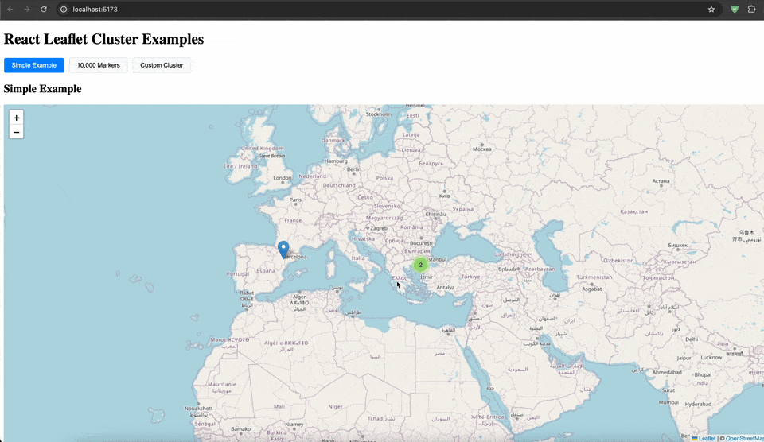

# react-leaflet-cluster [](https://www.npmjs.com/package/react-leaflet-cluster)

- [x] React-leaflet v4 support
- [x] Typescript support

React-leaflet-cluster is a plugin for react-leaflet. A wrapper component of Leaflet.markercluster. Ready to be integrated into your React.js application to create beautifully animated Marker Clustering functionality.



### Examples - Code Sandbox
* [10.000 marker](https://codesandbox.io/s/hidden-breeze-nrd3e?fontsize=14&hidenavigation=1&theme=dark)
* [Custom marker cluster](https://codesandbox.io/s/beautiful-pike-j2l0w?file=/src/App.tsx)

### Installation
`yarn add react-leaflet-cluster`

Or with npm:
`npm i react-leaflet-cluster`


#### Prerequisites
Make sure that you've installed react-leaflet and leaflet.
```json
"react": "18.x",
"leaflet": "1.8.x",
"react-leaflet": "4.0.x"
```

####  API
For more detailed guide and API see:
https://akursat.gitbook.io/marker-cluster/api

#### Usage

```tsx
import MarkerClusterGroup from 'react-leaflet-cluster'
import {MapContainer, Marker } from 'react-leaflet'
import 'leaflet/dist/leaflet.css'
import {addressPoints} from './realworld'

const Demo = () => {
  return (
    <MapContainer
      style={{height: '500px'}}
      center={[38.9637, 35.2433]}
      zoom={6}
      scrollWheelZoom={true}
    >
      <MarkerClusterGroup
        chunkedLoading
      >
        {(addressPoints as AdressPoint).map((address, index) => (
          <Marker
            key={index}
            position={[address[0], address[1]]}
            title={address[2]}
            icon={customIcon}
          ></Marker>
        ))}
      </MarkerClusterGroup>
    </MapContainer>
  )
}
```
